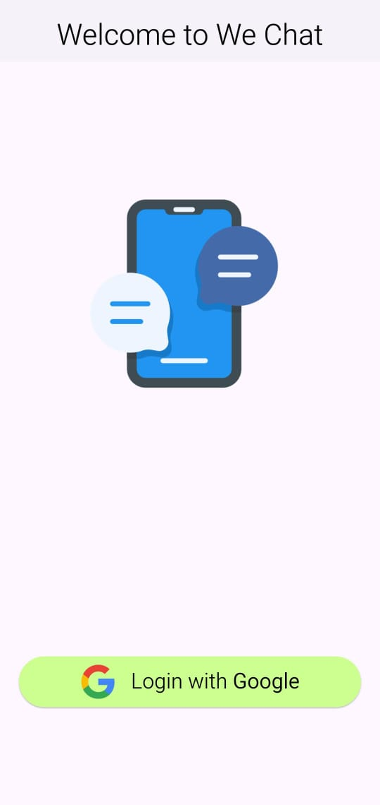
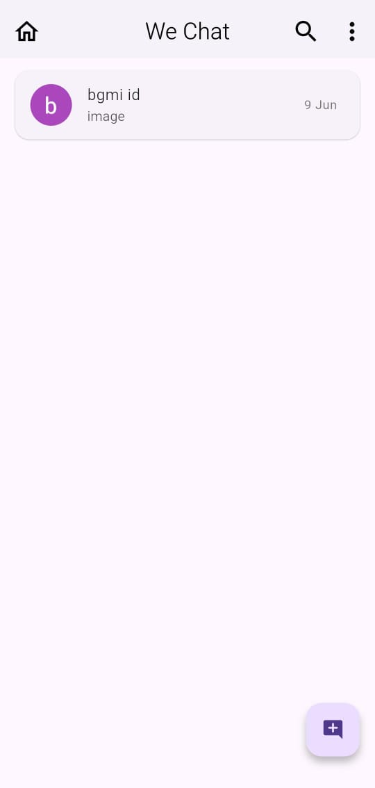
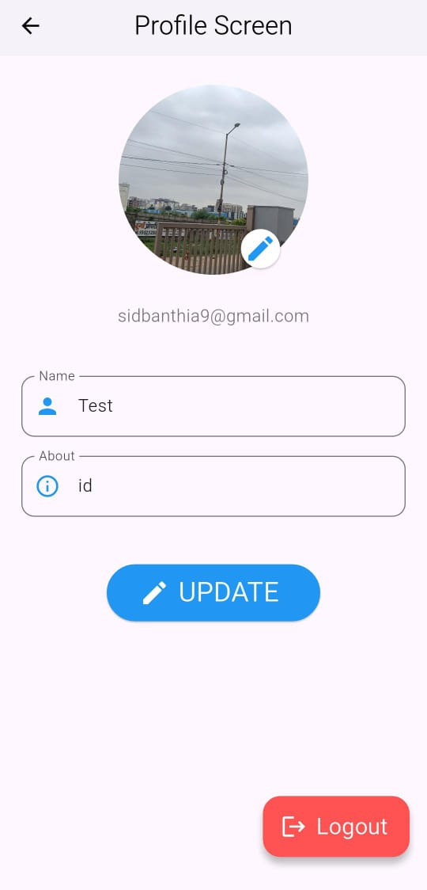
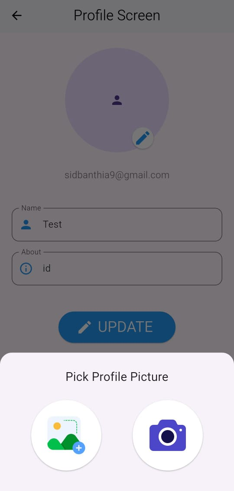

# 💬 Flutter Firebase Chat App

A real-time modern chat app built using **Flutter**, **Firebase**, and **REST APIs**, inspired by WhatsApp and guided by Harsh H. Rajpurohit's 50+ video course.

## 🚀 Features

- 🔥 Firebase Authentication (Google Sign-In)
- 🧠 MVVM Architecture with Clean Project Structure
- 📦 Firebase Firestore for real-time messaging
- 📸 Firebase Storage for profile and chat images
- 😎 Google Emoji Picker
- 🔔 Push Notifications via Firebase Messaging
- 🟢 Online/Offline status tracking
- 📤 Image Upload (camera/gallery)
- 📃 Message status (read/unread), last message timestamp
- 🔎 User search, profile view/edit
- 📄 Delete messages

## 🛠️ Tech Stack

- Flutter (Dart)
- Firebase Auth, Firestore, Storage, Realtime DB
- Firebase Messaging (Push Notifications)
- REST API for custom notifications
- MVVM architecture
- Google Sign-In
- Image Picker
- Emoji Picker

## 🧑‍💻 Setup Instructions

### Prerequisites:
- Flutter 3.x
- Firebase CLI
- Android Studio / VSCode
- A Firebase Project

### Steps:

# 1. Clone the repo
git clone https://github.com/your-username/flutter-chat-app.git
cd flutter-chat-app

# 2. Get dependencies
flutter pub get

# 3. Set up Firebase
flutterfire configure

# 4. Run the app
flutter run

## 📱 Screenshots

### 🔐 Login Page

---

### 🎉 Intro Screen

---

### 🏠 Home Screen

---

### 🧑‍💼 Profile Screen (with Image)

---

### 📷 Pick Profile Picture (Image Picker View)

